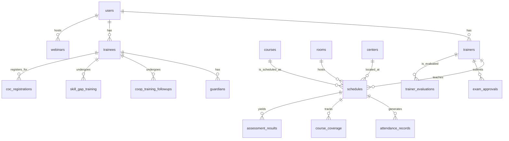

# ADMAS University TVET Management System (ATMS) - Comprehensive React Implementation Plan

## 1. Executive Summary

This document presents a comprehensive and detailed implementation plan for the modernization of the ADMAS University TVET Management System (ATMS) into a robust, scalable, and user-friendly React-based web application. The plan encompasses a thorough analysis of existing functionalities, detailed architectural designs, data modeling, state management strategies, API contracts, comprehensive data entry workflows, and a sophisticated report generation engine. The objective is to transform the current Access database-centric system into a modern, web-accessible platform that enhances operational efficiency, improves data accuracy, and provides a superior user experience for administrators, trainers, and trainees.

This plan is structured to provide a clear roadmap for development, covering all critical aspects from initial setup to deployment and future maintenance. It addresses the conversion of existing data structures, the design of intuitive user interfaces, the implementation of secure data handling practices, and the creation of powerful reporting capabilities that were previously managed within the Access database environment. By adopting a modern technology stack, ATMS will be better positioned to support the evolving needs of ADMAS University, offering greater flexibility, accessibility, and integration potential.

## 2. Introduction

### 2.1. Project Background and Rationale

The ADMAS University TVET Management System (ATMS) currently relies on an Access database, which, while functional, presents limitations in terms of scalability, accessibility, and modern user experience. The need for a web-based solution has become paramount to support remote access, accommodate a growing user base, and integrate with other digital platforms. This project aims to re-engineer the ATMS using React for the frontend, coupled with a robust backend (assumed to be a modern RESTful API with a scalable database) to deliver a high-performance, secure, and maintainable application.

### 2.2. Goals and Objectives

The primary goal of this project is to develop a modern web application that fully replicates and significantly enhances the functionalities of the existing ATMS. Specific objectives include:

*   **Enhanced Accessibility:** Provide secure, web-based access to the system from any location and device.
*   **Improved User Experience:** Design and implement intuitive and responsive user interfaces for all modules.
*   **Scalability and Performance:** Build a system capable of handling increased data volumes and user concurrency without degradation in performance.
*   **Data Integrity and Security:** Implement robust measures to ensure data accuracy, consistency, and protection against unauthorized access.
*   **Efficient Data Management:** Streamline data entry processes and provide powerful tools for data retrieval and analysis.
*   **Comprehensive Reporting:** Develop a flexible reporting engine that can generate various reports in multiple formats.
*   **Maintainability:** Utilize modern development practices and a modular architecture to ensure the system is easy to maintain and extend.

### 2.3. Scope of the Implementation Plan

This plan covers the following key areas:

*   **System Architecture:** High-level overview of the client-side (React) and backend components.
*   **Core Modules and Features:** Detailed breakdown of functionalities to be implemented.
*   **Data Models:** Mapping of existing Access database structures to modern database schemas.
*   **Module Structure and Routing:** Organization of the React application, including directory structure and navigation.
*   **State Management:** Strategy for managing application-wide and component-specific data.
*   **API Contract:** Definition of RESTful API endpoints for frontend-backend communication.
*   **Data Entry Systems and Workflows:** Design of user interfaces and processes for data input.
*   **Report Generation Engine:** Mechanisms for creating, customizing, and exporting various reports.
*   **Technology Stack:** Recommended tools and libraries for development.
*   **Development Methodology:** Agile approach, iteration planning, and quality assurance.
*   **Deployment Strategy:** Plans for hosting, continuous integration, and continuous deployment.
*   **Security Considerations:** Comprehensive security measures for the application and data.
*   **Testing Strategy:** Unit, integration, and end-to-end testing approaches.
*   **Future Enhancements:** Potential future features and scalability considerations.

## 3. Core Modules and Features

Based on the detailed feature breakdown provided in the `pasted_content.txt` file and the analysis of the Access database, the ATMS will comprise the following core modules. Each module represents a significant functional area requiring dedicated development effort.

### 3.1. Authentication & System Access

This foundational module ensures secure access to the system and manages user identities.

*   **User Login Portal:** A secure and intuitive login screen requiring a username and password. This will be the primary entry point for all users.
*   **Role-Based Access Control (RBAC):** Implementation of a robust RBAC system to restrict access to specific features and data based on the user's assigned role (e.g., Admin, Trainer, Trainee, Coordinator).
*   **Session Management:** Secure handling of user sessions, including token-based authentication (e.g., JWT) for stateless API communication.
*   **Password Management:** Functionality for password reset, change, and strong password policy enforcement.

### 3.2. Administrator Dashboard

The central hub for system monitoring and quick access to key functionalities.

*   **Comprehensive Top Navigation Bar:** A persistent navigation menu providing access to all major modules: Dashboard, TVET Scheduling, TVET Reports, TVET Assessment, Manage Complaints, Trainers Evaluation, Lifelong Learning, and System Administrator.
*   **Dropdown Menus:** Sub-navigation within the main menu items for organized access to specific features.
*   **High-Level KPI Counters:** Real-time display of critical metrics such as Quality Alerts, Active Trainers, Total Trainees, and Total Users. These will be dynamic and update based on system data.
*   **TVET Submissions Overview:** Quick-access widgets showing submission counts for various categories, including Attendance, Session Plans, Course Coverage, Assessment Plans, Practical Projects, Coop Reports, Skill Gap, Female Support, and Grades Imported. These widgets will provide at-a-glance status updates.

### 3.3. TVET Scheduling Module

This module provides robust tools for managing classes, trainers, rooms, and facilities.

*   **Manage Schedules (Spreadsheet View):** A tabular interface allowing users to view, filter, sort, and edit existing class schedules. Columns will include Year, Section, Course Title, Credit Hours, Schedule (Day/Time), Room, Center, Trainer Name, and Start/End dates.
*   **Advanced Schedule Entry:** A form-based interface for creating new class schedules. This will feature dropdown selections for various parameters (e.g., courses, trainers, rooms) to minimize data entry errors and facilitate conflict prevention.
*   **Interactive Classroom Schedule Grid:** A visual, calendar-style scheduling tool that maps out classes by room and time block. This feature will include an automated conflict detection system, providing real-time alerts (e.g., "Action Required: 15 Conflicts Detected") to prevent scheduling overlaps.
*   **Printable Trainer Load Report:** A comprehensive report calculating the total credit hours assigned to each trainer across different programs and years, including an estimate for invigilation days.
*   **Course Coordinator Report:** A tool to designate and view course coordinators based on criteria such as the trainer with the most credit hours for a specific course.
*   **Printable Schedule Report:** Generates a clean, formatted class schedule based on selected criteria (Year/Program and Section), suitable for printing or exporting.

### 3.4. User & Trainee Management

This module handles the administration of system users and trainee records.

*   **Manage Users:** A directory to view, edit, or delete system users. Displays Full Name, Username, Role & Type, and Contact information. Includes functionalities for adding new users and managing user permissions.
*   **Manage Trainees:** A detailed database of student records. Allows filtering by "Year" and "Section" and displays ID Number, Sex, Level, Year, Section. Provides action buttons for editing student profiles, viewing academic history, and managing personal details.

### 3.5. TVET Reports Module

A comprehensive suite of reporting tools for tracking academic progress and system compliance.

*   **View Attendance Submissions:** A log of submitted attendance records with options to view attached photos (if available) or delete entries (with appropriate permissions).
*   **View Course Coverage Submissions:** Tracks the progress of courses, showing total Learning Outcomes (LOs), covered LOs, and specific coverage text notes submitted by trainers.
*   **View Cooperative Training Follow-ups:** Logs details of visits to trainees at their cooperative training organizations, including visit dates, outcomes, and follow-up actions.
*   **View Skill Gap Training Reports:** Details specific skill gap training sessions, including learning outcomes targeted, duration, and attached photographic evidence.
*   **Overall Monthly Activity Report:** A generated summary for a specific month/year, compiling data on active trainers, submissions, COC (Center of Competence) registration summaries by department, and classes scheduled.

### 3.6. TVET Assessment Module

This module manages the assessment process, from exam approvals to result publication.

*   **Exam Approvals:** A review queue for "Draft/Pending Exams," showing theoretical and practical assessment plans submitted by trainers, with options to "Approve/Publish" or "View" the exam details.
*   **Institutional Assessment Results:** A published log of assessment results categorized by Title, Level, Assigned Section, and Date.
*   **COC Registration Submissions:** A ledger of students registered for their Center of Competence exams, showing their current level, contact info, and amount paid.

### 3.7. Trainers Evaluation

Tools for evaluating trainer performance and generating comprehensive review reports.

*   **Trainer of the Month Calculator:** A tool to calculate and determine the top-performing trainer based on an "Activity Score," "Workload Index," and "Rating."
*   **360° Trainer Evaluation Report:** A comprehensive performance review system that aggregates scores from Trainee Evaluation (60% weight), Peer Evaluation (5%), Self Evaluation (5%), and Department Evaluation (30%) to generate a final weighted score.

### 3.8. Lifelong Learning (LMS Features)

This module incorporates Learning Management System (LMS) functionalities.

*   **Manage Live Webinars:** A dashboard to schedule, manage, and start live online webinar sessions.
*   **Lifelong Learning Hub:** A student/user-facing interface with tabs for "Live Webinars" (showing registered webinars and links), "Online Courses (MOOC)," and "My Learning." This module will also address error handling for features like "Manage MOOC Courses" as identified in the initial analysis.

## 4. System Architecture

### 4.1. High-Level Architecture Overview

The ATMS will adopt a modern, decoupled architecture, separating the frontend (React application) from the backend (API and database). This approach offers flexibility, scalability, and allows for independent development and deployment of both components.

```mermaid
graph TD
    A[User] -->|Accesses via Web Browser| B(React Frontend)
    B -->|API Calls (HTTPS)| C(Backend API)
    C -->|Database Queries| D[Database]
    C -->|External Services| E(Email/SMS/Payment Gateways)
    B -->|State Management| F(Global State)
    B -->|Component Tree| G(UI Components)
```

**Figure 1: High-Level System Architecture**

### 4.2. Client-Side (React Application)

The React application will serve as the primary user interface, built with a focus on modularity, reusability, and maintainability. It will consume data from the backend API and render dynamic content to the user.

#### 4.2.1. Technology Stack for Frontend

*   **Framework:** React.js (with Create React App or Vite for scaffolding)
*   **Language:** TypeScript (for type safety and improved developer experience)
*   **Routing:** React Router (for declarative navigation)
*   **State Management:** Zustand (recommended for its simplicity, performance, and scalability, providing a Redux-like experience without the boilerplate). Alternatively, React Context API with `useReducer` for localized state.
*   **API Client:** Axios or Fetch API (for making HTTP requests to the backend)
*   **Styling:** Tailwind CSS (for utility-first CSS, rapid UI development, and responsive design). Alternatively, Styled Components or CSS Modules for component-scoped styling.
*   **UI Component Library:** Material-UI (MUI) or Ant Design (for pre-built, accessible, and customizable UI components).
*   **Data Visualization:** Chart.js or Recharts (for rendering interactive charts and graphs in reports and dashboards).
*   **Form Management:** React Hook Form or Formik (for efficient form handling and validation).

#### 4.2.2. Frontend Architectural Principles

*   **Component-Based Development:** The UI will be broken down into small, independent, and reusable components. This promotes modularity, simplifies testing, and accelerates development.
*   **Single Responsibility Principle (SRP):** Each component, module, or function should have a single, well-defined responsibility.
*   **Separation of Concerns:** Business logic, UI logic, and data fetching logic will be clearly separated.
*   **DRY (Don't Repeat Yourself):** Promote code reusability through custom hooks, utility functions, and shared components.
*   **Performance Optimization:** Implement strategies such as lazy loading (for routes and large components), memoization (using `React.memo`, `useMemo`, `useCallback`), virtualized lists for large datasets, and efficient data fetching to ensure a fast and responsive user experience.
*   **Accessibility (A11y):** Adhere to WCAG guidelines to ensure the application is usable by individuals with disabilities.
*   **Internationalization (i18n):** Design the application to support multiple languages, if required in the future.
*   **Responsive Design:** Ensure the application adapts seamlessly to various screen sizes and devices (desktops, tablets, mobile phones).

### 4.3. Backend (Assumed)

While the primary focus of this plan is the React frontend, a robust and scalable backend is essential to support the ATMS. The backend will expose a RESTful API for the frontend to consume and manage all data persistence and business logic.

#### 4.3.1. Technology Stack for Backend (Recommended)

*   **Language/Framework:** Node.js with Express.js, Python with Django/Flask, or Java with Spring Boot. (Node.js is often preferred for full-stack JavaScript development).
*   **Database:** PostgreSQL (relational, robust, scalable) or MongoDB (NoSQL, flexible schema for rapidly evolving data). MySQL/TiDB could also be considered given the Access database's relational nature.
*   **ORM/ODM:** Sequelize (for SQL databases) or Mongoose (for MongoDB) to interact with the database.
*   **Authentication:** Passport.js (Node.js) or similar libraries for handling user authentication and JWT generation.
*   **Deployment:** Docker for containerization, Kubernetes for orchestration, AWS/Google Cloud/Azure for cloud hosting.

#### 4.3.2. Backend Architectural Principles

*   **RESTful API Design:** Adhere to REST principles for clear, stateless communication between frontend and backend.
*   **Statelessness:** Each API request from the client to the server must contain all the information necessary to understand the request.
*   **Scalability:** Design the backend to be horizontally scalable, allowing for easy addition of more server instances to handle increased load.
*   **Security:** Implement robust security measures, including input validation, output encoding, protection against SQL injection, XSS, CSRF, and proper API rate limiting.
*   **Error Handling:** Consistent and informative error responses with appropriate HTTP status codes.
*   **Logging and Monitoring:** Implement comprehensive logging and monitoring to track application health, performance, and potential issues.
*   **Background Jobs:** For long-running tasks (e.g., complex report generation, bulk data processing), utilize a message queue (e.g., RabbitMQ, Kafka) and worker processes.

## 5. Data Models and Database Design

This section details the transformation of the existing Access database structure into a modern, relational database schema, suitable for a scalable web application. The goal is to optimize for data integrity, query performance, and ease of integration with the React frontend.

### 5.1. Data Mapping Strategy

The process involves analyzing each table from the Access database, identifying its purpose, fields, data types, and relationships, and then mapping these to a new, normalized schema. This will involve:

*   **Normalization:** Ensuring data redundancy is minimized and data integrity is maximized (e.g., 3NF).
*   **Appropriate Data Types:** Selecting modern, efficient data types for each field (e.g., `UUID` for primary keys, `DATE` for dates, `ENUM` for fixed lists).
*   **Consistent Naming Conventions:** Using `snake_case` for database columns and `camelCase` for API responses to maintain consistency.
*   **Primary and Foreign Keys:** Clearly defining primary keys for each table and foreign keys to establish relationships between tables.

### 5.2. Core Data Models (Derived from Access Database)

#### 5.2.1. `users` Table (Mapped from `Trainers Information` and `Students` for system users)

This table will store all system users, including trainers, administrators, and potentially trainees who log in.

| Field Name | Data Type | Constraints | Description |
| :--- | :--- | :--- | :--- |
| `id` | `UUID` | `PRIMARY KEY`, `NOT NULL` | Unique identifier for the user |
| `username` | `VARCHAR(50)` | `UNIQUE`, `NOT NULL` | User's login username |
| `password_hash` | `VARCHAR(255)` | `NOT NULL` | Hashed password for security |
| `email` | `VARCHAR(100)` | `UNIQUE`, `NOT NULL` | User's email address |
| `full_name` | `VARCHAR(255)` | `NOT NULL` | Full name of the user |
| `role` | `ENUM("Admin", "Trainer", "Trainee", "Coordinator")` | `NOT NULL` | User's role in the system |
| `department_id` | `UUID` | `FOREIGN KEY` (to `departments` table) | Department the user belongs to (if applicable) |
| `mobile_number` | `VARCHAR(20)` | `NULLABLE` | User's mobile contact number |
| `status` | `ENUM("Active", "Inactive", "Pending")` | `NOT NULL`, `DEFAULT 'Active'` | Current status of the user account |
| `created_at` | `TIMESTAMP` | `NOT NULL`, `DEFAULT CURRENT_TIMESTAMP` | Timestamp of user creation |
| `updated_at` | `TIMESTAMP` | `NOT NULL`, `DEFAULT CURRENT_TIMESTAMP ON UPDATE CURRENT_TIMESTAMP` | Last update timestamp |

#### 5.2.2. `trainers` Table (Detailed Trainer Information)

This table will hold specific details for trainers, linking to the `users` table.

| Field Name | Data Type | Constraints | Description |
| :--- | :--- | :--- | :--- |
| `id` | `UUID` | `PRIMARY KEY`, `NOT NULL` | Unique identifier for the trainer |
| `user_id` | `UUID` | `FOREIGN KEY` (to `users` table), `UNIQUE`, `NOT NULL` | Link to the user account |
| `staff_no` | `VARCHAR(20)` | `UNIQUE`, `NOT NULL` | Internal staff number |
| `employment_type` | `ENUM("FT", "PT")` | `NOT NULL` | Full-time or Part-time employment |
| `present_status` | `VARCHAR(50)` | `NULLABLE` | Specific status (e.g., "Released", "Admin") |

#### 5.2.3. `trainees` Table (Detailed Trainee Information)

This table will store specific details for trainees, linking to the `users` table.

| Field Name | Data Type | Constraints | Description |
| :--- | :--- | :--- | :--- |
| `id` | `UUID` | `PRIMARY KEY`, `NOT NULL` | Unique identifier for the trainee |
| `user_id` | `UUID` | `FOREIGN KEY` (to `users` table), `UNIQUE`, `NOT NULL` | Link to the user account |
| `student_id` | `VARCHAR(20)` | `UNIQUE`, `NOT NULL` | University issued student ID |
| `first_name` | `VARCHAR(50)` | `NOT NULL` | Given name |
| `last_name` | `VARCHAR(50)` | `NOT NULL` | Family name |
| `sex` | `ENUM("Male", "Female", "Other")` | `NULLABLE` | Gender of the trainee |
| `academic_level` | `VARCHAR(30)` | `NOT NULL` | TVET Level (e.g., I, II, III, IV) |
| `date_of_birth` | `DATE` | `NULLABLE` | Trainee's birth date |
| `address` | `TEXT` | `NULLABLE` | Full address |
| `city` | `VARCHAR(50)` | `NULLABLE` | City of residence |
| `emergency_contact_name` | `VARCHAR(100)` | `NULLABLE` | Name of emergency contact |
| `emergency_contact_phone_1` | `VARCHAR(25)` | `NULLABLE` | Primary emergency contact phone |
| `emergency_contact_relationship` | `VARCHAR(50)` | `NULLABLE` | Relationship to emergency contact |

#### 5.2.4. `courses` Table (Unit Information)

This table will store details about each course or unit.

| Field Name | Data Type | Constraints | Description |
| :--- | :--- | :--- | :--- |
| `id` | `UUID` | `PRIMARY KEY`, `NOT NULL` | Unique identifier for the course |
| `unit_code` | `VARCHAR(50)` | `UNIQUE`, `NOT NULL` | Course/Module code |
| `unit_title` | `TEXT` | `NOT NULL` | Full name of the course/module |
| `credit_hours` | `FLOAT` | `NOT NULL` | Number of credit hours |

#### 5.2.5. `schedules` Table (Mapped from `2011 first Sem tbl`)

This table will store detailed class scheduling information.

| Field Name | Data Type | Constraints | Description |
| :--- | :--- | :--- | :--- |
| `id` | `UUID` | `PRIMARY KEY`, `NOT NULL` | Unique identifier for the schedule entry |
| `entry_year` | `VARCHAR(4)` | `NOT NULL` | Student batch entry year |
| `section_code` | `VARCHAR(20)` | `NOT NULL` | Unique class section identifier |
| `course_id` | `UUID` | `FOREIGN KEY` (to `courses` table), `NOT NULL` | Link to the course details |
| `trainer_id` | `UUID` | `FOREIGN KEY` (to `trainers` table), `NOT NULL` | Link to the assigned trainer |
| `room_id` | `UUID` | `FOREIGN KEY` (to `rooms` table), `NOT NULL` | Link to the assigned room |
| `center_id` | `UUID` | `FOREIGN KEY` (to `centers` table), `NOT NULL` | Link to the campus/center |
| `academic_year` | `VARCHAR(9)` | `NOT NULL` | Academic year (e.g., 2024/2025) |
| `semester` | `VARCHAR(20)` | `NOT NULL` | Current semester |
| `schedule_time_1` | `VARCHAR(100)` | `NOT NULL` | Primary time slot (e.g., "Mon 8:00-10:00") |
| `schedule_time_2` | `VARCHAR(100)` | `NULLABLE` | Secondary time slot (if applicable) |
| `start_date` | `DATE` | `NULLABLE` | Start date of the schedule |
| `end_date` | `DATE` | `NULLABLE` | End date of the schedule |

#### 5.2.6. `guardians` Table

This table will store guardian information, linked to trainees.

| Field Name | Data Type | Constraints | Description |
| :--- | :--- | :--- | :--- |
| `id` | `UUID` | `PRIMARY KEY`, `NOT NULL` | Unique identifier for the guardian |
| `trainee_id` | `UUID` | `FOREIGN KEY` (to `trainees` table), `NOT NULL` | Link to the associated trainee |
| `first_name` | `VARCHAR(50)` | `NOT NULL` | Guardian's given name |
| `last_name` | `VARCHAR(50)` | `NOT NULL` | Guardian's family name |
| `relationship` | `VARCHAR(25)` | `NOT NULL` | Relationship to the trainee |
| `mobile_phone` | `VARCHAR(25)` | `NULLABLE` | Guardian's mobile number |
| `email` | `VARCHAR(50)` | `NULLABLE` | Guardian's email address |

#### 5.2.7. Auxiliary Tables (Examples)

*   **`departments`:** `id` (UUID), `name` (VARCHAR)
*   **`rooms`:** `id` (UUID), `room_number` (VARCHAR), `capacity` (INT), `center_id` (UUID FK)
*   **`centers`:** `id` (UUID), `name` (VARCHAR), `location` (TEXT)
*   **`attendance_records`:** `id` (UUID), `schedule_id` (UUID FK), `trainee_id` (UUID FK), `date` (DATE), `status` (ENUM), `photo_url` (TEXT), `notes` (TEXT)
*   **`course_coverage`:** `id` (UUID), `schedule_id` (UUID FK), `trainer_id` (UUID FK), `total_los` (INT), `covered_los` (INT), `coverage_notes` (TEXT), `date_submitted` (TIMESTAMP)
*   **`coop_training_followups`:** `id` (UUID), `trainee_id` (UUID FK), `visit_date` (DATE), `organization_name` (VARCHAR), `notes` (TEXT), `status` (ENUM)
*   **`skill_gap_training`:** `id` (UUID), `trainee_id` (UUID FK), `skill_area` (VARCHAR), `learning_outcomes` (TEXT), `duration_hours` (FLOAT), `trainer_id` (UUID FK), `evidence_url` (TEXT)
*   **`exam_approvals`:** `id` (UUID), `course_id` (UUID FK), `trainer_id` (UUID FK), `exam_type` (ENUM), `status` (ENUM), `submission_date` (TIMESTAMP), `approval_date` (TIMESTAMP), `exam_document_url` (TEXT)
*   **`assessment_results`:** `id` (UUID), `schedule_id` (UUID FK), `trainee_id` (UUID FK), `assessment_title` (VARCHAR), `score` (FLOAT), `grade` (VARCHAR), `date_recorded` (TIMESTAMP)
*   **`coc_registrations`:** `id` (UUID), `trainee_id` (UUID FK), `level` (VARCHAR), `registration_date` (DATE), `amount_paid` (DECIMAL), `status` (ENUM)
*   **`trainer_evaluations`:** `id` (UUID), `trainer_id` (UUID FK), `evaluator_id` (UUID FK), `evaluation_type` (ENUM), `score` (FLOAT), `comments` (TEXT), `evaluation_date` (TIMESTAMP)
*   **`webinars`:** `id` (UUID), `title` (VARCHAR), `description` (TEXT), `start_time` (TIMESTAMP), `end_time` (TIMESTAMP), `host_id` (UUID FK), `join_url` (TEXT)

### 5.3. Database Relationships

Establishing clear relationships between tables is crucial for data integrity and efficient querying. The database will enforce referential integrity.



**Figure 2: Entity-Relationship Diagram (Simplified)**

### 5.4. Seed Data — Trainer Master List (Real Production Data)

This section captures the **42 real trainers** of ADMAS University Misrak Campus, extracted from the official roster, to be loaded as authoritative seed data on first migration. This data is the source of truth for the `Trainer's Name`, `Department`, and `Employment Condition` columns that appear across every Trainer Course Load and Final Schedule report.

#### 5.4.1. Field Semantics and Normalization Rules

| Source Column | Maps To | Type / Domain | Normalization Rule |
| :--- | :--- | :--- | :--- |
| `No.` | (import order only) | `INT` | Not persisted; used only for deterministic seed ordering. |
| `Trainer Name` | `users.full_name` | `VARCHAR(255)`, `NOT NULL` | Stored verbatim, upper-cased and trimmed. A `display_name` (title-case) is derived for UI. Slugified to generate `username` (e.g., `yohannes.tesfaye`). Collisions resolved with a numeric suffix. |
| `Phone Number` | `users.mobile_number` | `VARCHAR(20)`, `NULLABLE` | 9-digit local form normalized to E.164 `+2519XXXXXXXX` (prepend `0` then map to `+251`). The literal `Missing` → `NULL` and a data-quality flag. |
| `Department` | `trainers.department_id` → `departments.code` | `ENUM('BUS','ACC','ICT')` | `BUS` = Business / Management, `ACC` = Accounting, `ICT` = Information & Communications Technology. |
| `Employment Condition` | `trainers.employment_type` | `ENUM('FT','PT')` | `FULL` → `FT` (full-time), `PART` → `PT` (part-time). |

> **Department seed (`departments` table):** `{ code:'BUS', name:'Business & Management' }`, `{ code:'ACC', name:'Accounting' }`, `{ code:'ICT', name:'Information & Communication Technology' }`.

#### 5.4.2. Data-Quality Flags (must be surfaced in the import report)

1.  **`AMARE ZELEKE` (No. 7)** — phone is `Missing` → persist `mobile_number = NULL`, set `data_quality.phone_missing = true`. Block nothing, but list in the post-import exception report.
2.  **`EYOB ABRAHAM` (No. 24) and `EYOB TEFERA` (No. 25)** — share the identical phone `922495039`. Both are seeded, but the duplicate is flagged (`data_quality.duplicate_phone = true`) for administrator reconciliation. Phone uniqueness is therefore **not** enforced as a hard DB constraint at seed time; it is enforced going forward via a soft (warning) validator.
3.  **`Kifle G/medihen` (No. 28)** — contains an Amharic abbreviation (`G/medihen` = "Gebremedihen"). Stored verbatim; `display_name` expands the abbreviation where confirmed.

#### 5.4.3. Aggregate Counts (import sanity-check assertions)

*   **Total trainers:** 42
*   **By department:** BUS = 17, ACC = 16, ICT = 9 (sum = 42)
*   **By employment:** Full-time (FT) = 15, Part-time (PT) = 27 (sum = 42)

The migration must `ASSERT` these totals after load; any deviation aborts the transaction.

#### 5.4.4. Canonical Seed (TypeScript)

```typescript
// src/db/seeds/trainers.seed.ts
// FULL -> 'FT' (full-time), PART -> 'PT' (part-time). dept: BUS|ACC|ICT.
export interface TrainerSeed {
  no: number;
  fullName: string;
  phone: string | null;   // E.164; null = missing
  dept: 'BUS' | 'ACC' | 'ICT';
  employment: 'FT' | 'PT';
  flags?: string[];
}

export const TRAINER_SEED: TrainerSeed[] = [
  { no: 1,  fullName: 'ABEBAW DEMEKE',        phone: '+251918784152', dept: 'BUS', employment: 'PT' },
  { no: 2,  fullName: 'ABEBE SHITU',          phone: '+251913122743', dept: 'BUS', employment: 'FT' },
  { no: 3,  fullName: 'ABERA BEKELE',         phone: '+251924574369', dept: 'BUS', employment: 'PT' },
  { no: 4,  fullName: 'ABRAHAM GETNET',       phone: '+251941691480', dept: 'ACC', employment: 'PT' },
  { no: 5,  fullName: 'AMAR ADEM',            phone: '+251910443195', dept: 'BUS', employment: 'FT' },
  { no: 6,  fullName: 'AMARE YERDAW',         phone: '+251936564314', dept: 'BUS', employment: 'PT' },
  { no: 7,  fullName: 'AMARE ZELEKE',         phone: null,            dept: 'BUS', employment: 'FT', flags: ['phone_missing'] },
  { no: 8,  fullName: 'AWOL BELACHEW',        phone: '+251910077222', dept: 'BUS', employment: 'PT' },
  { no: 9,  fullName: 'AYALNEH MUCHE',        phone: '+251937394493', dept: 'ACC', employment: 'FT' },
  { no: 10, fullName: 'BELAYHUN ADMASU',      phone: '+251920606224', dept: 'BUS', employment: 'PT' },
  { no: 11, fullName: 'BINIAM ABAYU',         phone: '+251933522952', dept: 'ICT', employment: 'PT' },
  { no: 12, fullName: 'BREKTI TEKLEMICHAEL',  phone: '+251912942693', dept: 'ICT', employment: 'PT' },
  { no: 13, fullName: 'DAWIT DEME',           phone: '+251939594861', dept: 'ICT', employment: 'PT' },
  { no: 14, fullName: 'DAWIT MULUGETA',       phone: '+251922633884', dept: 'BUS', employment: 'FT' },
  { no: 15, fullName: 'DAWIT TAREKEGN',       phone: '+251913004312', dept: 'ACC', employment: 'PT' },
  { no: 16, fullName: 'DEBAS GETAHUN',        phone: '+251911975167', dept: 'ACC', employment: 'PT' },
  { no: 17, fullName: 'DEJEN EZEZ',           phone: '+251938812353', dept: 'ACC', employment: 'PT' },
  { no: 18, fullName: 'DEMIS TALEGETA',       phone: '+251913040305', dept: 'ACC', employment: 'PT' },
  { no: 19, fullName: 'DESSIE ZEWEDU',        phone: '+251921289371', dept: 'ACC', employment: 'PT' },
  { no: 20, fullName: 'ELIAS WORKU',          phone: '+251915550755', dept: 'ICT', employment: 'PT' },
  { no: 21, fullName: 'EMALAF HIRUY',         phone: '+251911826620', dept: 'ACC', employment: 'FT' },
  { no: 22, fullName: 'ESAYAS MELES',         phone: '+251924154691', dept: 'ACC', employment: 'FT' },
  { no: 23, fullName: 'ESUBALEW MESFIN',      phone: '+251999630397', dept: 'ICT', employment: 'FT' },
  { no: 24, fullName: 'EYOB ABRAHAM',         phone: '+251922495039', dept: 'ICT', employment: 'FT', flags: ['duplicate_phone'] },
  { no: 25, fullName: 'EYOB TEFERA',          phone: '+251922495039', dept: 'ICT', employment: 'PT', flags: ['duplicate_phone'] },
  { no: 26, fullName: 'GETAHUN FANTAHUN',     phone: '+251969306767', dept: 'ACC', employment: 'FT' },
  { no: 27, fullName: 'HIWOT BAHERU',         phone: '+251946705502', dept: 'BUS', employment: 'PT' },
  { no: 28, fullName: 'KIFLE G/MEDIHEN',      phone: '+251938515317', dept: 'BUS', employment: 'PT', flags: ['amharic_abbrev'] },
  { no: 29, fullName: 'KINDEYE MEKURIYA',     phone: '+251985978742', dept: 'ACC', employment: 'PT' },
  { no: 30, fullName: 'LEMA KEMBIRA',         phone: '+251932096013', dept: 'BUS', employment: 'PT' },
  { no: 31, fullName: 'LIJALEM TADESE',       phone: '+251920976473', dept: 'ACC', employment: 'PT' },
  { no: 32, fullName: 'LINGEREW MINALU',      phone: '+251922718550', dept: 'ACC', employment: 'FT' },
  { no: 33, fullName: 'MENGESTU MULUNEH',     phone: '+251922458977', dept: 'ACC', employment: 'PT' },
  { no: 34, fullName: 'MULUGETA BEKELE',      phone: '+251913688827', dept: 'BUS', employment: 'FT' },
  { no: 35, fullName: 'REDIET TESFAYE',       phone: '+251912052705', dept: 'BUS', employment: 'FT' },
  { no: 36, fullName: 'SENAY BEGASHAW',       phone: '+251913583178', dept: 'BUS', employment: 'PT' },
  { no: 37, fullName: 'SOLOMON ANDARGE',      phone: '+251962932587', dept: 'ACC', employment: 'PT' },
  { no: 38, fullName: 'SOLOMON BRIHANU',      phone: '+251937206240', dept: 'BUS', employment: 'PT' },
  { no: 39, fullName: 'SURAFEL HAILEYESUS',   phone: '+251945335307', dept: 'ACC', employment: 'FT' },
  { no: 40, fullName: 'TADESSE MENGISTU',     phone: '+251924606361', dept: 'ICT', employment: 'FT' },
  { no: 41, fullName: 'YIHENEW BELAY',        phone: '+251933654337', dept: 'BUS', employment: 'PT' },
  { no: 42, fullName: 'YOHANNES TESFAYE',     phone: '+251954862623', dept: 'ICT', employment: 'PT' },
];
```

#### 5.4.5. Equivalent SQL Seed

```sql
-- Departments
INSERT INTO departments (code, name) VALUES
  ('BUS', 'Business & Management'),
  ('ACC', 'Accounting'),
  ('ICT', 'Information & Communication Technology')
ON CONFLICT (code) DO NOTHING;

-- Trainers (one row per person). user account is created first, trainer row links to it.
-- employment_type: 'FT' for FULL, 'PT' for PART.
-- Example for a single trainer; the migration loops TRAINER_SEED:
WITH new_user AS (
  INSERT INTO users (id, username, full_name, mobile_number, role, department_id, status)
  VALUES (gen_random_uuid(), 'yohannes.tesfaye', 'YOHANNES TESFAYE', '+251954862623',
          'Trainer', (SELECT id FROM departments WHERE code = 'ICT'), 'Active')
  RETURNING id
)
INSERT INTO trainers (id, user_id, staff_no, employment_type)
SELECT gen_random_uuid(), id, 'ATMS-T-042', 'PT' FROM new_user;
```

> **Linkage to reports:** every row above becomes a selectable value in the *Trainer* dropdown of the Advanced Schedule Entry form (§9.2.2) and the grouping key of the **Trainer Course Load** report (§10.6.1). The department drives the departmental aggregation in the Monthly Activity Report (§10.4.2) and the 360° Evaluation department weighting (§10.4.3).

## 6. Module Structure, Routing, and Component Hierarchy

This section details the organization of the React application, ensuring a scalable, maintainable, and logical structure.

### 6.1. Directory Structure

A feature-based directory structure is recommended. This approach groups all related files (components, hooks, services, styles) for a specific feature together, enhancing modularity and making it easier to locate and manage code.

```
src/
├── api/                # Centralized API client configuration and base services
├── assets/             # Static assets: images, fonts, global styles, icons
├── components/         # Global, reusable UI components (e.g., Button, Input, Modal, DataTable, LoadingSpinner)
│   ├── forms/          # Reusable form elements
│   ├── layout/         # Generic layout components (Header, Sidebar, Footer)
│   └── ui/             # Basic UI primitives
├── config/             # Application-wide configurations (e.g., API endpoints, constants, environment variables)
├── contexts/           # Global React Contexts (e.g., AuthContext, ThemeContext, NotificationContext)
├── hooks/              # Custom React hooks for reusable logic (e.g., useAuth, useForm, useDebounce)
├── layouts/            # Specific page layouts (e.g., AuthLayout, DashboardLayout, PublicLayout)
├── pages/              # Top-level page components, primarily responsible for routing and data orchestration
│   ├── auth/           # Login, Register, Forgot Password pages
│   ├── dashboard/      # Main dashboard page
│   ├── scheduling/     # Scheduling module pages
│   ├── users/          # User and Trainee management pages
│   ├── reports/        # Reporting module pages
│   ├── assessment/     # Assessment module pages
│   ├── evaluation/     # Trainer evaluation pages
│   └── lms/            # Lifelong Learning module pages
├── services/           # Business logic and data fetching specific to features (e.g., userService, scheduleService)
├── store/              # Global state management (Zustand stores for different domains)
│   ├── authStore.ts
│   ├── scheduleStore.ts
│   └── ...
├── styles/             # Global CSS, Tailwind CSS configuration
├── utils/              # General utility functions (e.g., date formatting, validation helpers)
├── App.tsx             # Main application component
├── index.tsx           # Entry point of the React application
├── routes.tsx          # Centralized route definitions
└── types/              # TypeScript type definitions and interfaces
```

**Figure 3: Recommended Frontend Directory Structure**

### 6.2. Routing Strategy

React Router will be the core library for managing navigation within the application. A centralized `routes.tsx` file will define all application routes, incorporating nested routes and protected routes to enforce access control.

#### 6.2.1. Public Routes

These routes are accessible without authentication.

*   `/login`: The primary user authentication portal.
*   `/forgot-password`: Page for users to reset their password.
*   `/register`: (Optional) If self-registration is allowed for certain user types.

#### 6.2.2. Protected Routes

These routes require a user to be authenticated and often authorized (based on their role) to access. A `ProtectedRoute` component will wrap these routes, redirecting unauthenticated users to the login page and unauthorized users to an access denied page.

*   `/`: Redirects to `/dashboard` upon successful login.
*   `/dashboard`: The Administrator Dashboard, displaying KPIs and overview widgets.
*   `/scheduling`: TVET Scheduling Module base route.
    *   `/scheduling/manage`: Manage Schedules (Spreadsheet View).
    *   `/scheduling/create`: Advanced Schedule Entry form.
    *   `/scheduling/grid`: Interactive Classroom Schedule Grid.
    *   `/scheduling/reports/trainer-load`: Printable Trainer Load Report.
    *   `/scheduling/reports/coordinator`: Course Coordinator Report.
    *   `/scheduling/reports/schedule`: Printable Schedule Report.
*   `/users`: User & Trainee Management base route.
    *   `/users/manage`: Manage system users (Admin role).
    *   `/users/trainees`: Manage trainees database.
    *   `/users/trainees/:id`: View/Edit specific trainee profile.
*   `/reports`: TVET Reports Module base route.
    *   `/reports/attendance`: View Attendance Submissions.
    *   `/reports/course-coverage`: View Course Coverage Submissions.
    *   `/reports/coop-training`: View Cooperative Training Follow-ups.
    *   `/reports/skill-gap`: View Skill Gap Training Reports.
    *   `/reports/monthly-activity`: Overall Monthly Activity Report.
*   `/assessment`: TVET Assessment Module base route.
    *   `/assessment/approvals`: Exam Approvals (Admin/Coordinator role).
    *   `/assessment/results`: Institutional Assessment Results.
    *   `/assessment/coc-registration`: COC Registration Submissions.
*   `/evaluation`: Trainers Evaluation base route.
    *   `/evaluation/calculator`: Trainer of the Month Calculator.
    *   `/evaluation/report`: 360° Trainer Evaluation Report.
*   `/lms`: Lifelong Learning (LMS Features) base route.
    *   `/lms/webinars`: Manage Live Webinars.
    *   `/lms/hub`: Lifelong Learning Hub (Student/User facing).
    *   `/lms/courses/:id`: View specific online course.

#### 6.2.3. Route Guards and Authorization

*   **`ProtectedRoute` Component:** A higher-order component or a custom hook that checks for authentication status (`isAuthenticated`) and user roles (`user.role`) before rendering the child components. If not authenticated, it redirects to `/login`. If authenticated but unauthorized, it redirects to an `/access-denied` page.
*   **Dynamic Routing:** Potentially, some routes or navigation items could be dynamically generated based on user roles or feature flags.

### 6.3. Component Hierarchy (Illustrative Example: TVET Scheduling Module)

Breaking down modules into a clear component hierarchy is essential for managing complexity. Below is an example for the TVET Scheduling Module, demonstrating how pages are composed of smaller, reusable components.

*   `App` (Root Component)
    *   `AuthLayout` (Layout for public routes like login)
        *   `LoginPage`
    *   `DashboardLayout` (Layout for authenticated routes, includes Header, Sidebar)
        *   `DashboardPage`
        *   `SchedulingModule` (Top-level container for all scheduling features)
            *   `SchedulingNavigation` (Component for sub-navigation within scheduling)
            *   `ManageSchedulesPage` (Corresponds to `/scheduling/manage`)
                *   `ScheduleFilterBar` (Contains filters for Year, Section, Course, etc.)
                    *   `DropdownSelect` (Reusable UI component)
                    *   `DatePicker` (Reusable UI component)
                *   `ScheduleDataTable` (Displays schedules in a tabular format)
                    *   `DataTableHeader`
                    *   `DataTableRow`
                        *   `EditScheduleButton` (Reusable UI component)
                        *   `DeleteScheduleButton` (Reusable UI component)
                    *   `PaginationControls`
                *   `AddScheduleModal` (Modal for adding new schedules)
                    *   `ScheduleForm` (Form for schedule entry)
            *   `CreateSchedulePage` (Corresponds to `/scheduling/create`)
                *   `ScheduleForm` (Detailed form for creating schedules)
                    *   `TrainerSelector` (Component to select trainers)
                    *   `RoomSelector` (Component to select rooms)
                    *   `ConflictWarningDisplay` (Displays real-time conflict alerts)
            *   `ScheduleGridPage` (Corresponds to `/scheduling/grid`)
                *   `CalendarView` (Main calendar component)
                    *   `DayColumn`
                        *   `TimeSlot`
                            *   `ClassCard` (Displays class details)
                *   `ConflictSummary` (Overview of detected conflicts)
            *   `TrainerLoadReportPage` (Corresponds to `/scheduling/reports/trainer-load`)
                *   `ReportFilters`
                *   `TrainerLoadTable`
                *   `ExportToPDFButton`
            *   `CourseCoordinatorReportPage` (Corresponds to `/scheduling/reports/coordinator`)
                *   `ReportFilters`
                *   `CoordinatorList`
            *   `PrintableScheduleReportPage` (Corresponds to `/scheduling/reports/schedule`)
                *   `ReportCriteriaForm`
                *   `FormattedScheduleDisplay`

## 7. State Management Strategy

Effective state management is crucial for complex React applications to ensure data consistency, predictable behavior, and maintainability. Given the scale of ATMS, a hybrid approach combining global and local state management is recommended.

### 7.1. Global State Management with Zustand

**Zustand** is recommended as the primary global state management library. Its advantages include:

*   **Simplicity:** Minimal boilerplate compared to Redux, making it easier to learn and implement.
*   **Performance:** Highly optimized, re-renders only affected components.
*   **Flexibility:** Can be used with or without React Context, integrates well with hooks.
*   **Scalability:** Suitable for large applications, allowing for multiple, independent stores for different domains (e.g., `authStore`, `scheduleStore`, `userStore`).

#### 7.1.1. Global State Domains

*   **Authentication State (`authStore`):**
    *   `isAuthenticated: boolean`
    *   `user: User | null` (stores `id`, `username`, `role`, `fullName`, etc.)
    *   `token: string | null`
    *   `login(credentials)`: Action to authenticate user, set `isAuthenticated`, `user`, `token`.
    *   `logout()`: Action to clear authentication state.
    *   `checkAuth()`: Action to validate token (e.g., on app load).

*   **UI State (`uiStore`):**
    *   `isLoading: boolean` (global loading indicator)
    *   `notifications: Notification[]` (for toast messages, alerts)
    *   `theme: 'light' | 'dark'`
    *   `setLoading(status)`: Action to control global loading state.
    *   `addNotification(message, type)`: Action to display notifications.

*   **Cached Data Stores (e.g., `courseStore`, `roomStore`, `trainerStore`):**
    *   `courses: Course[]`
    *   `rooms: Room[]`
    *   `trainers: Trainer[]`
    *   `fetchCourses()`: Action to fetch and cache course data.
    *   `fetchRooms()`: Action to fetch and cache room data.
    *   `fetchTrainers()`: Action to fetch and cache trainer data.
    *   These stores will be used for data that is frequently accessed across the application and doesn't change often, reducing redundant API calls.

### 7.2. Local Component State with React Hooks

React's built-in `useState` and `useReducer` hooks will be used for managing component-specific state. This includes:

*   **Form Inputs:** State for individual form fields.
*   **Modal/Dropdown Visibility:** Boolean flags to control UI element visibility.
*   **Temporary UI Interactions:** State related to animations, local filters, or sorting within a single component.
*   **`useReducer`:** For more complex local state logic that involves multiple related state transitions, similar to a small, isolated Redux store within a component.

### 7.3. Data Fetching and Caching with React Query (or SWR)

For efficient data fetching, caching, and synchronization with the backend, **React Query** (or SWR) is highly recommended. It provides powerful hooks for:

*   **Automatic Caching:** Caches fetched data, reducing redundant network requests.
*   **Background Refetching:** Automatically refetches stale data in the background.
*   **Error Handling:** Built-in mechanisms for handling API errors.
*   **Loading States:** Manages loading, success, and error states for data fetching.
*   **Pagination and Infinite Scrolling:** Simplifies implementation of complex data loading patterns.
*   **Optimistic Updates:** Improves perceived performance by updating the UI before the server responds.

```typescript
// Example using React Query
import { useQuery } from '@tanstack/react-query';
import { getSchedules } from '../services/scheduleService';

function SchedulesList() {
  const { data: schedules, isLoading, isError, error } = useQuery({
    queryKey: ['schedules'],
    queryFn: getSchedules,
  });

  if (isLoading) return <div>Loading schedules...</div>;
  if (isError) return <div>Error: {error?.message}</div>;

  return (
    // Render schedules data
  );
}
```

**Figure 4: React Query Example for Data Fetching**

## 8. API Contract

The frontend will interact with a RESTful API, adhering to consistent naming conventions, standard HTTP methods, and clear request/response structures. All API communication will be secured and require authentication.

### 8.1. General API Principles

*   **RESTful Design:** Use standard HTTP methods (GET, POST, PUT, DELETE) for CRUD operations.
*   **Resource-Oriented URLs:** URLs should represent resources (e.g., `/api/users`, `/api/schedules/:id`).
*   **JSON Payloads:** All request and response bodies will be in JSON format.
*   **Authentication:** All protected endpoints will require a valid JWT in the `Authorization` header (`Bearer <token>`).
*   **Error Handling:** Consistent error response structure with appropriate HTTP status codes and descriptive error messages.
*   **Pagination, Filtering, Sorting:** Support for these features via query parameters for list endpoints (e.g., `/api/users?page=1&limit=10&role=Trainer&sort=fullName:asc`).

### 8.2. API Endpoints (Expanded)

#### 8.2.1. Authentication Endpoints

*   `POST /api/auth/login`
    *   **Request:** `{ username, password }`
    *   **Response (Success 200):** `{ token: string, user: UserObject }`
    *   **Response (Error 401):** `{ message: 'Invalid credentials' }`
*   `POST /api/auth/logout`
    *   **Request:** (No body, token in header)
    *   **Response (Success 204):** (No content)
*   `GET /api/auth/me`
    *   **Request:** (No body, token in header)
    *   **Response (Success 200):** `{ user: UserObject }`
    *   **Response (Error 401):** `{ message: 'Unauthorized' }`

#### 8.2.2. User Management Endpoints

*   `GET /api/users`
    *   **Query Params:** `page`, `limit`, `role`, `search` (for `fullName`, `username`, `email`)
    *   **Response (Success 200):** `{ users: UserObject[], total: number, page: number, limit: number }`
*   `GET /api/users/:id`
    *   **Response (Success 200):** `{ user: UserObject }`
*   `POST /api/users`
    *   **Request:** `{ username, password, email, fullName, role, departmentId, mobileNumber, status }`
    *   **Response (Success 201):** `{ user: UserObject }`
*   `PUT /api/users/:id`
    *   **Request:** `{ email?, fullName?, role?, departmentId?, mobileNumber?, status? }`
    *   **Response (Success 200):** `{ user: UserObject }`
*   `DELETE /api/users/:id`
    *   **Response (Success 204):** (No content)

#### 8.2.3. Trainee Management Endpoints

*   `GET /api/trainees`
    *   **Query Params:** `page`, `limit`, `academicLevel`, `sectionCode`, `search` (for `studentId`, `fullName`)
    *   **Response (Success 200):** `{ trainees: TraineeObject[], total: number, page: number, limit: number }`
*   `GET /api/trainees/:id`
    *   **Response (Success 200):** `{ trainee: TraineeObject }`
*   `POST /api/trainees`
    *   **Request:** `{ userId, studentId, firstName, lastName, sex, academicLevel, dateOfBirth, address, city, emergencyContactName, emergencyContactPhone1, emergencyContactRelationship }`
    *   **Response (Success 201):** `{ trainee: TraineeObject }`
*   `PUT /api/trainees/:id`
    *   **Request:** `{ firstName?, lastName?, sex?, academicLevel?, dateOfBirth?, address?, city?, emergencyContactName?, emergencyContactPhone1?, emergencyContactRelationship? }`
    *   **Response (Success 200):** `{ trainee: TraineeObject }`
*   `DELETE /api/trainees/:id`
    *   **Response (Success 204):** (No content)

#### 8.2.4. Scheduling Endpoints

*   `GET /api/schedules`
    *   **Query Params:** `page`, `limit`, `academicYear`, `semester`, `sectionCode`, `trainerId`, `roomId`, `centerId`, `courseId`, `startDate`, `endDate`
    *   **Response (Success 200):** `{ schedules: ScheduleObject[], total: number, page: number, limit: number }`
*   `GET /api/schedules/:id`
    *   **Response (Success 200):** `{ schedule: ScheduleObject }`
*   `POST /api/schedules`
    *   **Request:** `{ entryYear, sectionCode, courseId, trainerId, roomId, centerId, academicYear, semester, scheduleTime1, scheduleTime2?, startDate?, endDate? }`
    *   **Response (Success 201):** `{ schedule: ScheduleObject }`
*   `PUT /api/schedules/:id`
    *   **Request:** `{ entryYear?, sectionCode?, courseId?, trainerId?, roomId?, centerId?, academicYear?, semester?, scheduleTime1?, scheduleTime2?, startDate?, endDate? }`
    *   **Response (Success 200):** `{ schedule: ScheduleObject }`
*   `DELETE /api/schedules/:id`
    *   **Response (Success 204):** (No content)
*   `GET /api/schedules/conflicts`
    *   **Query Params:** `academicYear`, `semester`, `sectionCode?`, `trainerId?`, `roomId?`, `startDate?`, `endDate?`
    *   **Response (Success 200):** `{ conflicts: ConflictObject[] }` (e.g., `{ type: 'room', scheduleId1, scheduleId2, details: 'Room 203 double booked' }`)
*   `GET /api/schedules/reports/trainer-load`
    *   **Query Params:** `academicYear`, `semester`, `departmentId?`
    *   **Response (Success 200):** `{ report: TrainerLoadReportObject[] }`

#### 8.2.5. Reports Module Endpoints (Examples)

*   `GET /api/reports/attendance`
    *   **Query Params:** `page`, `limit`, `scheduleId`, `traineeId`, `dateFrom`, `dateTo`
    *   **Response (Success 200):** `{ attendanceRecords: AttendanceRecordObject[], total: number, page: number, limit: number }`
*   `POST /api/reports/attendance`
    *   **Request:** `{ scheduleId, traineeId, date, status, photoUrl?, notes? }`
    *   **Response (Success 201):** `{ attendanceRecord: AttendanceRecordObject }`
*   `GET /api/reports/course-coverage`
    *   **Query Params:** `page`, `limit`, `scheduleId`, `trainerId`, `dateFrom`, `dateTo`
    *   **Response (Success 200):** `{ courseCoverage: CourseCoverageObject[], total: number, page: number, limit: number }`
*   `POST /api/reports/course-coverage`
    *   **Request:** `{ scheduleId, trainerId, totalLos, coveredLos, coverageNotes }`
    *   **Response (Success 201):** `{ courseCoverage: CourseCoverageObject }`

#### 8.2.6. Assessment Module Endpoints (Examples)

*   `GET /api/assessment/exams`
    *   **Query Params:** `page`, `limit`, `status`, `trainerId`, `courseId`
    *   **Response (Success 200):** `{ exams: ExamApprovalObject[], total: number, page: number, limit: number }`
*   `POST /api/assessment/exams`
    *   **Request:** `{ courseId, trainerId, examType, assessmentPlanDetails, examDocumentUrl }`
    *   **Response (Success 201):** `{ exam: ExamApprovalObject }`
*   `PUT /api/assessment/exams/:id/approve`
    *   **Request:** (No body)
    *   **Response (Success 200):** `{ exam: ExamApprovalObject }`

### 8.3. Error Response Structure

All API error responses will follow a consistent structure to facilitate robust error handling on the frontend.

```json
{
  "status": "error",
  "message": "A descriptive error message.",
  "code": "ERROR_CODE_ENUM", // Optional: specific error code for programmatic handling
  "details": [
    { "field": "username", "message": "Username is already taken." },
    { "field": "password", "message": "Password must be at least 8 characters." }
  ] // Optional: for validation errors
}
```

**Figure 5: Standard API Error Response Structure**

## 9. Data Entry Systems and Workflows

This section elaborates on the design of user interfaces and workflows for data input, emphasizing user experience, validation, and data integrity. Each data entry point will be designed to be intuitive and efficient.

### 9.1. General Data Entry Principles

*   **Form Design:** Clean, uncluttered layouts with clear labels, placeholders, and helpful tooltips.
*   **Input Types:** Utilize appropriate HTML5 input types (e.g., `email`, `date`, `number`) for better user experience and basic validation.
*   **Client-Side Validation:** Provide immediate feedback to users as they type, preventing submission of invalid data. This enhances user experience but does not replace server-side validation.
*   **Server-Side Validation:** All data submitted to the API will undergo rigorous server-side validation to ensure data integrity and security.
*   **Dropdowns and Autocompletes:** For fields with predefined options (e.g., roles, departments, courses, trainers, rooms), use dropdowns or autocomplete components to ensure data consistency and reduce typing errors.
*   **Date Pickers:** Implement user-friendly date picker components for all date input fields.
*   **File Uploads:** Provide secure and intuitive interfaces for uploading documents or images (e.g., attendance photos, exam documents).
*   **Confirmation Dialogs:** For destructive actions (e.g., deleting a record), present a confirmation dialog to prevent accidental data loss.
*   **Success/Error Notifications:** Provide clear visual feedback to the user upon successful data submission or in case of errors.

### 9.2. Module-Specific Data Entry Workflows (Detailed)

#### 9.2.1. User and Trainee Management

**A. User Creation/Editing Form:**

*   **Access:** Accessible via the "Manage Users" section (Admin role required).
*   **Fields:** Username (text input), Password (password input, with confirm password), Email (email input), Full Name (text input), Role (dropdown: Admin, Trainer, Trainee, Coordinator), Department (autocomplete/dropdown), Mobile Number (text input), Status (dropdown: Active, Inactive, Pending).
*   **Workflow:**
    1.  Admin clicks "Add New User" or "Edit User" button.
    2.  Form appears (modal or dedicated page).
    3.  Admin fills in/edits fields.
    4.  Client-side validation provides instant feedback.
    5.  Admin clicks "Save."
    6.  API call (`POST /api/users` or `PUT /api/users/:id`).
    7.  Server-side validation and database update.
    8.  Success/error notification displayed.

**B. Trainee Registration/Editing Form:**

*   **Access:** Accessible via the "Manage Trainees" section (Admin/Registrar role required).
*   **Fields:** Student ID (text input), First Name, Last Name, Sex (radio buttons/dropdown), Academic Level (dropdown), Date of Birth (date picker), Address (textarea), City (text input), Emergency Contact Name, Phone, Relationship.
*   **Workflow:** Similar to user creation, with specific validation rules for trainee data.

#### 9.2.2. TVET Scheduling Module

**A. Advanced Schedule Entry Form:**

*   **Access:** Accessible via the "TVET Scheduling" module (Coordinator/Admin role required).
*   **Fields:** Academic Year (dropdown), Semester (dropdown), Section Code (text input/dropdown), Course (autocomplete/dropdown linked to `courses` table), Credit Hours (auto-filled from course selection), Trainer (autocomplete/dropdown linked to `trainers` table), Room (autocomplete/dropdown linked to `rooms` table), Center (dropdown), Schedule Time 1 (text input/time picker), Schedule Time 2 (optional text input/time picker), Start Date (date picker), End Date (date picker).
*   **Workflow:**
    1.  User selects parameters.
    2.  **Real-time Conflict Detection:** As trainer, room, or time slots are selected, the frontend will make API calls (`GET /api/schedules/conflicts`) to check for potential overlaps. A visual indicator (e.g., a red warning message) will appear if conflicts are detected.
    3.  User reviews conflicts and adjusts as necessary.
    4.  User clicks "Save."
    5.  API call (`POST /api/schedules`).
    6.  Server-side re-validation of conflicts and data integrity.
    7.  Success/error notification.

**B. Interactive Classroom Schedule Grid (Drag-and-Drop/Click-to-Edit):**

*   **Access:** Accessible via the "TVET Scheduling" module.
*   **Functionality:** Users can visually assign classes to rooms and time slots. Drag-and-drop functionality for moving schedules, and click-to-edit for modifying details.
*   **Workflow:**
    1.  User drags a course from a list onto a time slot in the grid.
    2.  Frontend triggers a temporary state update and a conflict check.
    3.  If no conflict, a confirmation appears. If conflict, a warning appears.
    4.  Upon confirmation, an API call (`PUT /api/schedules/:id` or `POST /api/schedules`) is made to update the schedule.

#### 9.2.3. TVET Reports Module (Data Submission Forms)

**A. Attendance Submission Form:**

*   **Access:** Accessible via the "TVET Reports" module (Trainer role required).
*   **Fields:** Select Class/Schedule (dropdown, filtered by trainer's assigned classes), Date (date picker), Trainee List (dynamically loaded, with checkboxes/toggles for Present/Absent/Late status for each trainee), Optional Notes (textarea), Photo Attachment (file upload).
*   **Workflow:**
    1.  Trainer selects class and date.
    2.  Trainee list populates. Trainer marks attendance.
    3.  (Optional) Trainer uploads photo evidence.
    4.  Trainer clicks "Submit."
    5.  API call (`POST /api/reports/attendance`).
    6.  Success/error notification.

**B. Course Coverage Submission Form:**

*   **Access:** Accessible via the "TVET Reports" module (Trainer role required).
*   **Fields:** Select Class/Schedule (dropdown), Total Learning Outcomes (display only, from course data), Covered Learning Outcomes (number input), Coverage Notes (textarea).
*   **Workflow:**
    1.  Trainer selects class.
    2.  Trainer enters covered LOs and notes.
    3.  Client-side validation ensures `coveredLos <= totalLos`.
    4.  Trainer clicks "Submit."
    5.  API call (`POST /api/reports/course-coverage`).
    6.  Success/error notification.

#### 9.2.4. TVET Assessment Module (Data Submission Forms)

**A. Exam Approval Submission Form:**

*   **Access:** Accessible via the "TVET Assessment" module (Trainer role required).
*   **Fields:** Select Course (dropdown), Exam Type (radio buttons: Theoretical, Practical), Assessment Plan Details (textarea), Exam Document (file upload).
*   **Workflow:**
    1.  Trainer fills in details and uploads exam document.
    2.  Trainer clicks "Submit for Approval."
    3.  API call (`POST /api/assessment/exams`).
    4.  Status set to "Pending." Notification sent to approver.

**B. Institutional Assessment Results Entry Form:**

*   **Access:** Accessible via the "TVET Assessment" module (Trainer/Assessor role required).
*   **Fields:** Select Schedule/Course (dropdown), Trainee List (dynamically loaded, with number input for scores/grades for each trainee).
*   **Workflow:**
    1.  Trainer selects schedule.
    2.  Trainee list populates. Trainer enters scores.
    3.  Client-side validation for score ranges.
    4.  Trainer clicks "Submit."
    5.  API call (`POST /api/assessment/results`).

#### 9.2.5. Trainers Evaluation (Data Submission Forms)

**A. 360° Trainer Evaluation Form:**

*   **Access:** Accessible via a dedicated link or module, based on evaluator type (Trainee, Peer, Self, Department Head).
*   **Fields:** Select Trainer (if not self-evaluation), Evaluation Criteria (set of radio buttons/sliders for rating scales 1-5 for various aspects), Comments (textarea).
*   **Workflow:**
    1.  Evaluator selects trainer (if applicable).
    2.  Evaluator rates criteria and adds comments.
    3.  Evaluator clicks "Submit."
    4.  API call (`POST /api/evaluation/submit`).
    5.  Success notification.

## 10. Report Generation Engine and Output Formats

This section details the design of the report generation engine, covering various report types, data sources, generation mechanisms, and output formats. The goal is to provide flexible, accurate, and visually appealing reports for all stakeholders.

### 10.1. General Principles for Report Generation

*   **Data Integrity:** Reports will always draw directly from the authoritative database, ensuring accuracy and consistency with real-time data.
*   **Customization and Filtering:** All reports will offer robust filtering, sorting, and aggregation options to allow users to generate highly specific and relevant reports.
*   **Performance Optimization:** Report queries and rendering will be optimized to handle large datasets efficiently, minimizing wait times for users.
*   **Security and Access Control:** Access to specific reports and the data contained within them will be strictly governed by the user's role and permissions.
*   **User-Friendly Presentation:** Reports will be designed with clear layouts, appropriate data visualizations (charts, graphs), and intuitive navigation.
*   **Multiple Output Formats:** Support for on-screen display, PDF for printing and official records, and Excel/CSV for further data analysis.

### 10.2. Report Generation Mechanisms

#### 10.2.1. On-Screen Display (Client-Side Rendering)

*   **Technology:** React components, often utilizing specialized data table libraries (e.g., `react-table`, `AG Grid`) for advanced features like sorting, filtering, and pagination. Data visualization libraries like Chart.js or Recharts will be used for interactive graphs and charts.
*   **Use Cases:** Dashboards, real-time metrics, interactive lists (e.g., Manage Schedules, Manage Users), and reports where users need to frequently interact with and manipulate the data directly within the application.
*   **Process:**
    1.  Frontend makes API calls (e.g., `GET /api/reports/attendance?filter=...`) to fetch filtered and paginated data from the backend.
    2.  React components receive the data and render it into dynamic tables, charts, and other UI elements.
    3.  User interactions (e.g., changing filters, sorting columns) trigger new API calls or client-side data manipulation.

#### 10.2.2. PDF Generation

PDF is essential for official records, printing, and sharing static reports. A hybrid approach is recommended.

*   **Server-Side PDF Generation (Recommended for Complex Reports):**
    *   **Technology:** Libraries like `Puppeteer` (Node.js) to render HTML templates into high-quality PDFs, or dedicated PDF generation libraries (e.g., `ReportLab` in Python, `iText` in Java). This approach is preferred for complex, multi-page reports with precise formatting, headers, footers, and dynamic content that might be difficult to render consistently client-side.
    *   **Use Cases:** Printable Schedule Reports, Trainer Load Reports, Official Monthly Activity Reports, Certificates, Transcripts.
    *   **Process:**
        1.  Frontend sends report parameters (filters, date ranges) to a dedicated backend API endpoint (e.g., `POST /api/reports/generate-pdf`).
        2.  Backend fetches the necessary data from the database.
        3.  Backend uses a templating engine (e.g., Handlebars, Pug) to generate HTML content for the report.
        4.  The HTML content is then fed to the PDF generation library (e.g., Puppeteer) to create the PDF file.
        5.  The generated PDF file is streamed back to the frontend, triggering a download for the user.

*   **Client-Side PDF Generation (For Simpler Reports/Print Views):**
    *   **Technology:** Libraries like `jsPDF` or `html2canvas` can convert existing HTML content directly from the browser into a PDF. This is simpler to implement for basic reports or for providing a 
print-friendly view of an on-screen report.
    *   **Use Cases:** Simple lists, single-page summaries, or when the user explicitly wants to print what they see on screen.
    *   **Process:**
        1.  Frontend fetches data and renders it into an HTML element.
        2.  User clicks "Print" or "Export to PDF."
        3.  `jsPDF` or `html2canvas` captures the HTML content and converts it into a PDF.
        4.  The PDF is then downloaded by the browser.

#### 10.2.3. Excel/CSV Export (Server-Side)

*   **Technology:** Server-side libraries such as `openpyxl` (Python) or `exceljs` (Node.js) are used to generate `.xlsx` files. For simpler data, CSV (Comma Separated Values) can be generated by formatting data as plain text with commas.
*   **Use Cases:** Raw data exports for advanced statistical analysis, integration with other systems, or when users prefer to manipulate data in spreadsheet software.
*   **Process:**
    1.  Frontend sends export parameters (filters, selected columns) to a backend API endpoint (e.g., `GET /api/reports/export-excel`).
    2.  Backend fetches the requested data.
    3.  Backend uses the chosen library to create an Excel workbook or CSV file.
    4.  The generated file is streamed back to the frontend, triggering a download.

### 10.3. Report Customization and Filtering

Each report interface will provide a rich set of customization options to empower users to generate highly specific and relevant information.

*   **Dynamic Filter Panels:** Intuitive UI elements for applying filters based on various criteria.
    *   **Date Range Selectors:** For reports spanning specific periods (e.g., attendance, course coverage, monthly activity).
    *   **Dropdowns/Multi-selects:** For filtering by Academic Year, Semester, Department, Section, Trainer, Course, Center, Status, etc.
    *   **Search Bars:** For free-text searches on fields like trainee names, unit titles, or notes.
*   **Sorting and Pagination:** For tabular reports, users will be able to sort columns in ascending or descending order and navigate through large datasets using pagination controls.
*   **Column Visibility Toggle:** Users can select which columns to display in a report, allowing them to focus on relevant data.
*   **Export Options:** Clearly visible buttons for exporting the current report view to PDF, Excel, or CSV.

### 10.4. Specific Report Designs (Examples)

#### 10.4.1. Printable Trainer Load Report

*   **Layout:** Professional, tabular format with a header including university logo, report title, date generated, and applied filters. Each trainer will have a row detailing their assigned courses, credit hours, and calculated invigilation days.
*   **Calculations:** Sum of `Contact_Hours` for each trainer, grouped by `AcYear` and `Semester`. Invigilation days can be estimated based on a predefined ratio or rule.
*   **Visualizations:** (Optional) A bar chart showing total credit hours per department or top 5 trainers by workload.

#### 10.4.2. Overall Monthly Activity Report

*   **Layout:** Summary dashboard style, with sections for different KPIs. Includes a header with the selected month and year.
*   **Sections:**
    *   **Trainer Activity:** Number of active trainers, average submissions per trainer.
    *   **Submission Summary:** Total counts for Attendance, Course Coverage, Assessment Plans, etc., for the month.
    *   **COC Registration Summary:** Breakdown of COC registrations by department or academic level.
    *   **Scheduling Overview:** Number of classes scheduled, rooms utilized.
*   **Visualizations:** Pie charts for COC registration breakdown, line graphs for submission trends over the month.

#### 10.4.3. 360° Trainer Evaluation Report

*   **Layout:** Detailed report for a single trainer, including a summary of their overall score, breakdown by evaluation category (Trainee, Peer, Self, Department), and qualitative comments.
*   **Calculations:** Weighted average of scores from different evaluation sources (e.g., Trainee 60%, Peer 5%, Self 5%, Department 30%).
*   **Visualizations:** Radar charts or bar charts to visually compare scores across different evaluation criteria or against departmental averages.

### 10.5. Security Considerations for Reports

*   **Role-Based Access Control (RBAC):** Granular permissions will dictate which users can view, generate, and export which reports. For instance, trainers might only see reports related to their own classes and trainees, while department heads can view departmental aggregates, and administrators have full access.
*   **Data Masking/Anonymization:** For certain reports, sensitive personal identifiable information (PII) might be masked or anonymized for users who do not have explicit permission to view it.
*   **Secure Data Transmission:** All report data, whether displayed on-screen or downloaded, will be transmitted over HTTPS to ensure encryption and prevent eavesdropping.
*   **Audit Trails:** Generation and access of critical reports will be logged, providing an audit trail for compliance and security monitoring.

### 10.6. Source Report Specifications — Reverse-Engineered from Production Outputs

The following specifications were extracted **field-by-field from the actual printed reports** currently produced by the legacy Access system (the "ADMAS UNIVERSITY — Misrak Campus" outputs). Every report listed here must be reproduced pixel-faithfully (header band, logo, color, grouping, footers) so that printed output is indistinguishable from the legacy documents during parallel-run/cutover. Two report families exist: **Trainer Course Load** and **Final Schedule (Class Schedule)**.

#### 10.6.1. Report A — "Trainer Course Load"

A per-trainer load sheet. The document repeats one **group block per trainer**, each block being a self-contained mini-report with its own header, table, total, class-end banner, and signature line. Multiple trainers print on a single page when they fit.

**Page/Group Header fields**

| # | Field (as printed) | Source | Data Type | Notes |
| :--- | :--- | :--- | :--- | :--- |
| 1 | University logo + "ADMAS UNIVERSITY" | static asset / `institution.name` | image + `VARCHAR` | Top band, centered. |
| 2 | "Misrak Campus" | `centers.campus_label` | `VARCHAR(50)` | Sub-title. |
| 3 | "Trainer Course Load" | static report title | `VARCHAR` | Report type label. |
| 4 | Academic Year | `schedules.academic_year` | `VARCHAR(4)` (Eth. cal., e.g. `2017`) | Labeled "Academic Year:". |
| 5 | Semester | `schedules.semester` | `VARCHAR(30)` | Free-text in legacy (e.g. "ai for 2017 etry 2", "T FOR 2014 EX"); see §10.9 for normalization. |
| 6 | Trainer's Name | `users.full_name` (via `trainers`) | `VARCHAR(255)` | **Grouping key.** One block per value. |

**Detail table columns** (one row per `schedule` assigned to the trainer)

| Col | Header (as printed) | Source | Data Type | Notes |
| :--- | :--- | :--- | :--- | :--- |
| 1 | `Section` | `schedules.section_code` | `VARCHAR(20)` | e.g. `17-1RHC1`, `14-1EHA1` (see §10.8 code grammar). |
| 2 | `Unit Title` | `courses.unit_title` | `TEXT` | e.g. "Entrepreneurship for employability - I". |
| 3 | `Contact H` (printed truncated as ":act H") | `courses.credit_hours` | `INT`/`FLOAT` | Zero-padded 2-digit display (`04`, `02`). |
| 4 | `Schedule I` | `schedules.schedule_time_1` | `VARCHAR(100)` | e.g. "Monday 06:00 -08:00". |
| 5 | `Schedule II` | `schedules.schedule_time_2` | `VARCHAR(100)` `NULLABLE` | Often blank. |
| 6 | `Room_No` | `rooms.room_number` | `VARCHAR(10)` `NULLABLE` | e.g. `203`, `101`; blank when unassigned. |
| 7 | `Center` | `centers.name` | `VARCHAR(30)` | e.g. "Misrak-1", "YEKA", "LEM", "MISRAK-". |

**Group footer fields**

| Field (as printed) | Source | Data Type | Rule |
| :--- | :--- | :--- | :--- |
| `Total Weekly Load` | computed | `INT` | **SUM of `Contact H` over the trainer's rows**, 2-digit display (`08`,`10`,`12`). |
| `Class End:` (yellow banner) | `schedules.end_date` (Eth.) | `VARCHAR`/`DATE` | e.g. "megabit 20", "TAHESAS 30, 2017 E.C." — Ethiopian month/day; highlight `#FFFF00`. |
| `Department Head's Name: ____` | blank manual field | n/a | Print underscore rule; not data-bound. |
| `Singiture: ____` (sic) | blank manual field | n/a | Signature line (legacy typo preserved on legacy form; corrected to "Signature" in new report — see §10.7). |
| `Date: ____` | blank manual field | n/a | Manual sign-off date. |

**Document footer:** print date (`Thursday, June 18, 2026` — Gregorian, system clock) on the left, `Page N of M` on the right.

#### 10.6.2. Report B — "Final Schedule" / "Class Schedule"

A program-wide schedule grouped **one block per section/cohort**. Header band is shaded grey with a red "FINAL SCHEDULE" tag.

**Page header fields**

| # | Field (as printed) | Source | Data Type | Notes |
| :--- | :--- | :--- | :--- | :--- |
| 1 | Logo + "ADMAS UNIVERSITY" / "Misrak Campus" | static / `centers.campus_label` | image + `VARCHAR` | |
| 2 | "FINAL SCHEDULE" | report-status tag | `ENUM('DRAFT','FINAL')` | Red; reflects publication state. |
| 3 | "Class Schedule" | static title | `VARCHAR` | |
| 4 | `AcYear` | `schedules.academic_year` | `VARCHAR(4)` | e.g. `2017`. |
| 5 | `Semester` | `schedules.semester` | `VARCHAR(30)` | e.g. "1st semi for 2017", "SEMI 1", "2017 LAST FOR". |

**Per-section block:** a `Section` band (e.g. `17-1EHA1`, `13-3EHA1`) followed by a table.

| Col | Header (as printed) | Source | Data Type | Notes |
| :--- | :--- | :--- | :--- | :--- |
| 1 | `Unit Title` | `courses.unit_title` | `TEXT` | Yellow header row. |
| 2 | `Schedule I` | `schedules.schedule_time_1` | `VARCHAR(100)` | e.g. "Thursday 12:00 -02:00". |
| 3 | `Room_No` | `rooms.room_number` | `VARCHAR(10)` `NULLABLE` | Blank for ICT/lab centers in samples. |
| 4 | `Center` | `centers.name` | `VARCHAR(30)` | "LEM", "Misrak-1", "YEKA". |
| 5 | `Trainer's Name` | `users.full_name` | `VARCHAR(255)` | Must resolve to a row in §5.4 seed. |

**Document footer:** print date (Gregorian) left, `Page N of M` right.

### 10.7. Report Design & Layout Requirements (Detail Needed)

These are the binding presentation rules the report engine must honor for both report families.

*   **Brand band:** ADMAS logo (left), institution name in the brand serif/blackletter face, "Misrak Campus" sub-line. Reserve a configurable logo slot (`institution.logo_url`).
*   **Color tokens:** table header fills observed — **light-blue** (`#BDD7EE`) for Course Load tables, **yellow** (`#FFFF00`) for Final Schedule unit-title header rows and for the "Class End" banner. Alternating row stripe (`#FCE4D6`/white) in Course Load. These become theme tokens, not hard-coded values.
*   **Grouping & repetition:** Report A groups by **trainer**; Report B groups by **section**. Each group renders header → table → (Course Load only) total + banner + signature. Page breaks must **never split a group's header from its first data row** (keep-with-next).
*   **Totals row:** bold "Total Weekly Load" aligned under the `Contact H` column, value = SUM of contact hours; rendered with 2-digit zero padding to match legacy.
*   **Empty cells:** blank (never `NULL`/`0`/`-`) to match legacy output for `Schedule II`, `Room_No`.
*   **Typo correction:** legacy prints "Singiture" — the new report prints **"Signature"** while a compatibility flag (`report.preserveLegacyLabels=true`) can restore the original spelling for byte-faithful parallel runs.
*   **Signature block:** three underscore rules (Department Head's Name / Signature / Date), not data-bound, printed once per Course Load group.
*   **Footers:** left = generation timestamp in **Gregorian** local time (e.g., "Thursday, June 18, 2026"); right = `Page N of M`. Both are layout-injected, not data fields.
*   **Output channels:** on-screen (HTML), **server-side PDF** (Puppeteer HTML→PDF, per §10.2.2 — required because of grouping, keep-with-next, and banners), and Excel/CSV (flattened — one row per schedule with the group key repeated, totals as a subtotal row).
*   **Filters (parameters) for both reports:** `academicYear` (required), `semester` (required), `centerId`, `departmentId`; Report A adds `trainerId` (multi-select), Report B adds `sectionCode` / `entryYear` / `programLevel`.

### 10.8. Section & Course Code Grammar (decoded from samples)

The `section_code` is a compact composite key seen as `17-1RHC1`, `14-1EHA1`, `13-3EHA2`, `17-1EHM6`. The engine must parse and also re-compose it. Inferred grammar (to be confirmed with the registrar before enforcing as a hard constraint):

```
<EntryYear> "-" <Level> <Stream> <Block> <Dept> <SectionNo>
   17           1       E/R     H       A/C/M    1..n
```

| Token | Sample values | Meaning (inferred) | Stored as |
| :--- | :--- | :--- | :--- |
| EntryYear | `17`, `14`, `13` | Ethiopian-calendar batch entry year | `schedules.entry_year VARCHAR(4)` |
| Level | `1`, `3` | TVET program level / year | `section.level INT` |
| Stream | `E`, `R` | program stream (e.g. Extension / Regular) | `section.stream CHAR(1)` |
| Block | `H` | cohort/shift block | `section.block CHAR(1)` |
| Dept | `A`, `C`, `M` | dept code: `A`→Accounting(ACC), `C`→ICT, `M`→Management(BUS) | `section.dept_letter CHAR(1)` |
| SectionNo | `1`, `2`, `6` | section ordinal | `section.section_no INT` |

> The full `section_code` is also stored verbatim in `schedules.section_code` so that legacy reports remain reproducible even if the decoding rule is later revised. The decoded department letter must be **cross-checked** against the trainer's department (§5.4) and the unit's owning department; mismatches raise a soft validation warning in the schedule-entry workflow (§9.2.2).

### 10.9. Ethiopian Calendar & Locale Handling (report-critical)

The legacy reports mix calendars and free-text dates; the new engine standardizes this:

*   **Academic Year / Semester / Class End** are entered and displayed in the **Ethiopian calendar** (e.g., `2017`, "megabit 20", "TAHESAS 30, 2017 E.C."). Store a canonical `DATE` (Gregorian) **plus** the Ethiopian display string; render Ethiopian month names from a lookup (`መስከረም…ጳጉሜን` / Latin: Meskerem…Pagume; "megabit"=Megabit, "TAHESAS"=Tahsas).
*   **Generation timestamps** in footers stay **Gregorian** (system clock), matching legacy.
*   `semester` legacy strings ("ai for 2017 etry 2", "T FOR 2014 EX", "SEMI 1") are messy → introduce a normalized `semester_code ENUM('SEM1','SEM2','EXIT','SUMMER')` while retaining the raw legacy label in `semester_legacy_label` for faithful reprints.

### 10.10. Report-to-Database Connection / Data-Binding Matrix

The exact joins each report executes (the "report design connect requirement"). All reports are parameterized server-side queries feeding the templating engine (§10.2.2).

| Report | Driving table | Required joins | Group key | Aggregation | Order |
| :--- | :--- | :--- | :--- | :--- | :--- |
| **A. Trainer Course Load** | `schedules` | `→ trainers → users` (name, dept), `→ courses` (title, hours), `→ rooms` (room_no), `→ centers` (name) | `users.full_name` | `SUM(courses.credit_hours)` per trainer = *Total Weekly Load* | trainer name ASC, then `section_code`, then day/time |
| **B. Final / Class Schedule** | `schedules` | `→ courses`, `→ trainers → users`, `→ rooms`, `→ centers` | `schedules.section_code` | none (listing) | section ASC, then day/time |
| Trainer Load summary chart | `schedules` | as A, `→ departments` | `departments.code` | `SUM(credit_hours)` per dept | total DESC |
| Monthly Activity (§10.4.2) | `schedules` + submission tables | `→ departments`, COC tables | `departments.code`, month | counts/sums | dept ASC |

**Canonical query — Trainer Course Load (parameterized):**

```sql
SELECT u.full_name              AS trainer_name,
       d.code                   AS department,
       s.section_code,
       c.unit_title,
       c.credit_hours           AS contact_h,
       s.schedule_time_1        AS schedule_i,
       s.schedule_time_2        AS schedule_ii,
       r.room_number            AS room_no,
       ce.name                  AS center,
       s.academic_year, s.semester,
       SUM(c.credit_hours) OVER (PARTITION BY t.id) AS total_weekly_load
FROM schedules s
JOIN trainers   t  ON t.id = s.trainer_id
JOIN users      u  ON u.id = t.user_id
JOIN departments d ON d.id = u.department_id
JOIN courses    c  ON c.id = s.course_id
LEFT JOIN rooms r  ON r.id = s.room_id
JOIN centers    ce ON ce.id = s.center_id
WHERE s.academic_year = :acYear
  AND s.semester      = :semester
  AND (:centerId IS NULL OR s.center_id = :centerId)
  AND (:trainerId IS NULL OR t.id = ANY(:trainerId))
ORDER BY u.full_name, s.section_code, s.schedule_time_1;
```

**Corresponding API endpoints** (extend §8.2.4):

*   `GET /api/schedules/reports/trainer-load` → JSON grouped by trainer (each group carries `totalWeeklyLoad`).
*   `GET /api/schedules/reports/trainer-load/pdf` → streamed PDF (server-side render).
*   `GET /api/schedules/reports/class-schedule` → JSON grouped by section.
*   `GET /api/schedules/reports/class-schedule/pdf` → streamed PDF.
*   Shared query params: `academicYear` (req), `semester` (req), `centerId?`, `departmentId?`, `trainerId?` (multi), `sectionCode?`, `entryYear?`, `status?` (`DRAFT`/`FINAL`), `format?` (`json`/`pdf`/`xlsx`/`csv`).

**Frontend binding:** React Query keys `['report','trainer-load',params]` and `['report','class-schedule',params]`; the grouped JSON renders into the `TrainerLoadReportPage` / `PrintableScheduleReportPage` components (§6.3), with an `ExportToPDF/Excel` control hitting the `*/pdf` and `?format=xlsx` endpoints.

## 11. Technology Stack and Development Environment

This section consolidates the recommended technologies and tools for building the ATMS, ensuring a modern, efficient, and collaborative development process.

### 11.1. Frontend Technology Stack

*   **Core Framework:** React.js (version 18+)
*   **Language:** TypeScript (version 5+)
*   **Build Tool:** Vite (for fast development server and optimized builds) or Create React App (for simpler projects)
*   **Package Manager:** pnpm (for efficient disk space usage and faster installs) or npm/yarn
*   **Routing:** React Router DOM (version 6+)
*   **State Management:** Zustand (for global state) and React Context API/`useReducer` (for localized state)
*   **Data Fetching/Caching:** React Query (or SWR) for robust data management
*   **Styling:** Tailwind CSS (for utility-first styling) with PostCSS and Autoprefixer
*   **UI Component Library:** Material-UI (MUI) or Ant Design (for pre-built, accessible components)
*   **Form Management:** React Hook Form (for performant and flexible form handling)
*   **Validation:** Zod or Yup (for schema validation)
*   **Data Visualization:** Chart.js or Recharts
*   **Testing Frameworks:** Jest, React Testing Library (for unit and integration tests), Cypress or Playwright (for end-to-end tests)
*   **Code Formatting:** Prettier
*   **Linting:** ESLint (with React and TypeScript plugins)

### 11.2. Backend Technology Stack (Recommended for a new implementation)

*   **Language:** Node.js (version 18+)
*   **Framework:** Express.js or NestJS (for building scalable REST APIs)
*   **Database:** PostgreSQL (for relational data, robustness, and advanced features)
*   **ORM:** Sequelize or TypeORM (for interacting with PostgreSQL)
*   **Authentication:** Passport.js (for local, JWT, OAuth strategies)
*   **Validation:** Joi or class-validator
*   **Logging:** Winston or Pino
*   **Task Scheduling:** Node-cron or Agenda.js (for background jobs like report generation)
*   **File Storage:** AWS S3 or Google Cloud Storage (for storing uploaded photos, documents)
*   **Email/SMS Services:** Nodemailer, Twilio (for notifications)

### 11.3. Development Environment

*   **IDE:** Visual Studio Code (with recommended extensions for React, TypeScript, ESLint, Prettier, Tailwind CSS)
*   **Version Control:** Git (hosted on GitHub, GitLab, or Bitbucket)
*   **Containerization:** Docker (for consistent development, testing, and production environments)
*   **Cloud Platform:** AWS, Google Cloud Platform, or Azure (for hosting backend, database, and static frontend assets)
*   **CI/CD:** GitHub Actions, GitLab CI/CD, Jenkins (for automated testing, building, and deployment)

## 12. Development Methodology

An Agile development methodology, specifically Scrum, is recommended for this project to ensure flexibility, continuous feedback, and iterative delivery of value.

### 12.1. Agile Principles

*   **Iterative Development:** Work will be broken down into short, time-boxed iterations (sprints).
*   **Incremental Delivery:** Functional increments of the software will be delivered regularly.
*   **Customer Collaboration:** Regular engagement with stakeholders to gather feedback and adapt to changing requirements.
*   **Responding to Change:** Embrace changes in requirements even late in development.
*   **Self-Organizing Teams:** Empower development teams to organize and manage their work.

### 12.2. Scrum Framework

*   **Roles:**
    *   **Product Owner:** Responsible for defining and prioritizing the product backlog, representing stakeholder interests.
    *   **Scrum Master:** Facilitates Scrum events, removes impediments, and coaches the team on Scrum principles.
    *   **Development Team:** Cross-functional team responsible for delivering potentially shippable increments of the product.
*   **Events:**
    *   **Sprint Planning:** At the beginning of each sprint, the team plans the work to be done.
    *   **Daily Scrum (Stand-up):** Short daily meetings to synchronize activities and plan for the next 24 hours.
    *   **Sprint Review:** At the end of each sprint, the team demonstrates completed work to stakeholders and gathers feedback.
    *   **Sprint Retrospective:** The team reflects on the past sprint and identifies areas for improvement.
*   **Artifacts:**
    *   **Product Backlog:** A prioritized list of features, enhancements, bug fixes, and other work to be done.
    *   **Sprint Backlog:** A subset of the product backlog selected for a specific sprint.
    *   **Increment:** The sum of all product backlog items completed during a sprint and all previous sprints.

### 12.3. Project Phases (High-Level)

1.  **Discovery & Planning (Current Phase):** Detailed requirements gathering, architectural design, technology selection, and initial project planning.
2.  **Setup & Infrastructure:** Setting up development environments, CI/CD pipelines, cloud infrastructure, and initial project scaffolding.
3.  **Module Development (Iterative Sprints):** Developing each core module (Authentication, Dashboard, Scheduling, etc.) in iterative sprints, focusing on delivering functional increments.
4.  **Integration & Testing:** Continuous integration of modules, comprehensive testing (unit, integration, E2E), and bug fixing.
5.  **User Acceptance Testing (UAT):** Engaging end-users and stakeholders to validate the system against business requirements.
6.  **Deployment & Launch:** Deploying the application to production and making it available to users.
7.  **Post-Launch Support & Maintenance:** Monitoring, bug fixes, performance optimization, and ongoing feature enhancements.

## 13. Security Considerations

Security will be a paramount concern throughout the entire development lifecycle. A multi-layered approach will be adopted to protect the application and its data.

### 13.1. Application Security

*   **Input Validation:** Strict validation of all user inputs on both client-side and server-side to prevent injection attacks (SQL Injection, XSS).
*   **Output Encoding:** Proper encoding of all data rendered to the UI to prevent Cross-Site Scripting (XSS) attacks.
*   **Authentication:** Strong password policies, multi-factor authentication (MFA) support (if required), and secure token management (JWTs stored securely, short-lived access tokens, refresh tokens).
*   **Authorization:** Granular Role-Based Access Control (RBAC) implemented on both frontend (for UI elements) and backend (for API endpoints) to ensure users can only access resources they are authorized for.
*   **Session Management:** Secure session handling, including session expiration, invalidation on logout, and protection against session hijacking.
*   **Cross-Site Request Forgery (CSRF) Protection:** Implementation of CSRF tokens for state-changing requests.
*   **Security Headers:** Utilize HTTP security headers (e.g., Content Security Policy, X-Frame-Options, X-Content-Type-Options) to mitigate common web vulnerabilities.
*   **Dependency Scanning:** Regularly scan third-party libraries and dependencies for known vulnerabilities.
*   **Error Handling:** Avoid revealing sensitive information in error messages. Implement custom error pages.

### 13.2. Data Security

*   **Encryption in Transit:** All communication between the client, backend, and database will be encrypted using HTTPS/SSL/TLS.
*   **Encryption at Rest:** Sensitive data in the database (e.g., passwords, PII) will be encrypted at rest.
*   **Database Security:** Implement strong database access controls, regularly patch database software, and follow best practices for database hardening.
*   **Data Backup and Recovery:** Implement a robust data backup and recovery strategy to prevent data loss.
*   **Data Masking/Anonymization:** For non-production environments or specific reporting needs, sensitive data will be masked or anonymized.

### 13.3. Infrastructure Security

*   **Network Security:** Implement firewalls, intrusion detection/prevention systems, and network segmentation.
*   **Access Control:** Strict access controls for servers and cloud resources (e.g., IAM roles).
*   **Regular Patching:** Keep all operating systems, servers, and software up to date with the latest security patches.
*   **Monitoring and Alerting:** Implement comprehensive monitoring for security events and configure alerts for suspicious activities.

## 14. Testing Strategy

A multi-faceted testing strategy will be employed to ensure the quality, reliability, and performance of the ATMS application.

### 14.1. Unit Testing

*   **Purpose:** To test individual functions, components, and small units of code in isolation.
*   **Frameworks:** Jest, React Testing Library.
*   **Coverage:** Aim for high code coverage (e.g., 80%+) for critical business logic and UI components.
*   **Implementation:** Developers will write unit tests as part of their development process.

### 14.2. Integration Testing

*   **Purpose:** To test the interaction between different modules or components, ensuring they work together as expected.
*   **Frameworks:** Jest, React Testing Library (for frontend component integration), Supertest (for backend API integration).
*   **Implementation:** Focus on testing the interfaces between components, services, and API endpoints.

### 14.3. End-to-End (E2E) Testing

*   **Purpose:** To simulate real user scenarios and test the entire application flow from start to finish, including UI interactions, API calls, and database operations.
*   **Frameworks:** Cypress or Playwright.
*   **Implementation:** Critical user journeys (e.g., login, schedule creation, report generation) will be covered by E2E tests.

### 14.4. Performance Testing

*   **Purpose:** To evaluate the application's responsiveness, stability, and scalability under various load conditions.
*   **Tools:** Apache JMeter, LoadRunner, K6.
*   **Metrics:** Response time, throughput, error rates, resource utilization.

### 14.5. Security Testing

*   **Purpose:** To identify vulnerabilities and weaknesses in the application's security posture.
*   **Methods:** Penetration testing, vulnerability scanning, code reviews, static application security testing (SAST), dynamic application security testing (DAST).

### 14.6. User Acceptance Testing (UAT)

*   **Purpose:** To validate that the developed system meets the business requirements and is fit for purpose from the end-user's perspective.
*   **Process:** Key stakeholders and end-users will be involved in testing the application in a pre-production environment, providing feedback and approving functionalities.

## 15. Deployment Strategy

A robust deployment strategy will ensure the application is reliably delivered to users, with minimal downtime and efficient updates.

### 15.1. Continuous Integration (CI)

*   **Tools:** GitHub Actions, GitLab CI/CD, Jenkins.
*   **Process:** Every code commit will trigger an automated build, run unit and integration tests, and perform code quality checks. This ensures that new code integrates smoothly and defects are caught early.

### 15.2. Continuous Deployment (CD)

*   **Tools:** GitHub Actions, GitLab CI/CD, AWS CodePipeline, Google Cloud Build.
*   **Process:** Upon successful completion of CI steps and passing all tests, the application will be automatically deployed to staging or production environments. Manual approval gates can be introduced for production deployments.

### 15.3. Hosting Environment

*   **Frontend (Static Assets):** Hosted on a Content Delivery Network (CDN) like AWS S3 + CloudFront, Google Cloud Storage, or Netlify for high availability and fast global access.
*   **Backend (API):** Deployed on cloud-based virtual machines (AWS EC2, Google Compute Engine) or container orchestration platforms (AWS ECS, Google Kubernetes Engine) for scalability and resilience.
*   **Database:** Managed database services (AWS RDS for PostgreSQL, Google Cloud SQL) for ease of management, backups, and scalability.

### 15.4. Monitoring and Logging

*   **Tools:** Prometheus + Grafana (for metrics and dashboards), ELK Stack (Elasticsearch, Logstash, Kibana) or cloud-native logging services (AWS CloudWatch, Google Cloud Logging) for centralized logging and analysis.
*   **Alerting:** Configure alerts for critical system events, errors, and performance thresholds.

## 16. Future Enhancements and Scalability

This section outlines potential future features and considerations for scaling the ATMS to meet evolving needs.

### 16.1. Potential Future Features

*   **Mobile Application:** Develop native iOS/Android applications using React Native, leveraging the existing API.
*   **Integration with External Systems:** Integrate with other university systems (e.g., student information systems, HR systems) via APIs.
*   **AI-Powered Analytics:** Implement machine learning models for predictive analytics (e.g., predicting student performance, optimizing schedules).
*   **Personalized Dashboards:** Allow users to customize their dashboard views based on their preferences and roles.
*   **Notification System:** Advanced real-time notifications (in-app, email, SMS) for important events (e.g., schedule changes, new assessment approvals).
*   **Feedback and Support Module:** A dedicated module for users to submit feedback, report issues, and access support resources.
*   **Gamification:** Introduce gamified elements to encourage engagement (e.g., badges for trainers, leaderboards).

### 16.2. Scalability Considerations

*   **Horizontal Scaling:** Design the backend services to be stateless, allowing for easy addition of more instances to handle increased load.
*   **Database Sharding/Replication:** For very large datasets, consider database sharding or read replicas to distribute load.
*   **Caching:** Implement caching layers (e.g., Redis, Memcached) for frequently accessed data to reduce database load.
*   **Load Balancing:** Use load balancers to distribute incoming traffic across multiple frontend and backend instances.
*   **Microservices Architecture:** As the system grows, consider breaking down the monolithic backend into smaller, independently deployable microservices.

## 17. Conclusion

This comprehensive implementation plan provides a detailed roadmap for the successful development and deployment of the ADMAS University TVET Management System as a modern React application. By adhering to the outlined architectural principles, development methodologies, and security best practices, the project team will deliver a high-quality, scalable, and user-centric system that significantly enhances the educational and administrative capabilities of ADMAS University. The transition from an Access database to a web-based platform will unlock new possibilities for efficiency, accessibility, and future growth, ensuring ATMS remains a vital tool for TVET management.

## 18. References

*   [React Documentation](https://react.dev/)
*   [React Router Documentation](https://reactrouter.com/en/main)
*   [Zustand Documentation](https://zustand-zustand.vercel.app/)
*   [React Query Documentation](https://tanstack.com/query/latest)
*   [Tailwind CSS Documentation](https://tailwindcss.com/)
*   [Material-UI Documentation](https://mui.com/)
*   [Access Database File Analysis (pasted_content.txt)](/home/ubuntu/upload/pasted_content.txt)
*   [ATMS Data Mapping](/home/ubuntu/atms_data_mapping.md)
*   [ATMS Data Entry Workflows](/home/ubuntu/atms_data_entry_workflows.md)
*   [ATMS Report Generation](/home/ubuntu/atms_report_generation.md)
